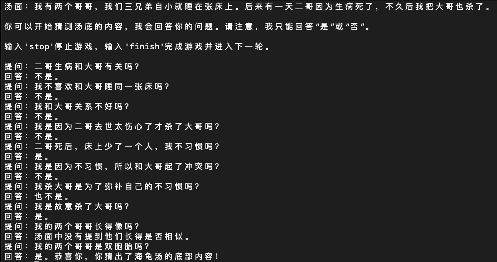

# 基于大模型的文字类游戏

## 介绍

本仓库致力于实现基于语言模型的文字类游戏。目前的游戏类型有海龟汤，后续将加入更多类型游戏。

## 游戏Demo

我们提供了一个基于 [Gradio](https://gradio.app) 的网页版 Demo 和一个命令行 Demo。使用时首先需要下载本仓库：

```shell
git clone https://github.com/mkw18/LLMTextGame
cd LLMTextGame
pip install -r requirements.txt
```

由于游戏效果演示是用gpt-3.5，所以使用时要先在交互界面中输入自己的openai api key。

### 网页版 Demo


首先安装 Gradio：`pip install gradio`，然后运行仓库中的 [web_demo_zh.py](web_demo_zh.py)或英文版 [web_demo_en.py](web_demo_en.py)： 

```shell
python web_demo_zh.py
python web_demo_en.py
```

程序会运行一个 Web Server，并输出地址。在浏览器中打开输出的地址，先在OpenAI API Key文本框中输入自己的API，点击Apply API按钮应用API，然后即可开始使用。点击New Game按钮刷新游戏。最新版 Demo 实现了打字机效果，速度体验大大提升。注意，由于国内 Gradio 的网络访问较为缓慢，启用 `demo.queue().launch(share=True, inbrowser=True)` 时所有网络会经过 Gradio 服务器转发，导致打字机体验大幅下降，现在默认启动方式已经改为 `share=False`，如有需要公网访问的需求，可以重新修改为 `share=True` 启动。

### 命令行 Demo



运行仓库中 [cli_demo_zh.py](cli_demo_zh.py)或英文版[cli_demo_en.py](cli_demo_en.py)：

```shell
python cli_demo_zh.py
python cli_demo_en.py
```

程序会在命令行中进行交互式的对话，首先会要求输入OpenAI API Key，然后在命令行中用户可以开始游戏，输入 `finish` 可以清空对话历史并开始新游戏，输入 `stop` 终止程序。

## 协议

本仓库的代码依照 [Apache-2.0](LICENSE) 协议开源，ChatGLM-6B 模型的权重的使用则需要遵循 [Model License](MODEL_LICENSE)。
