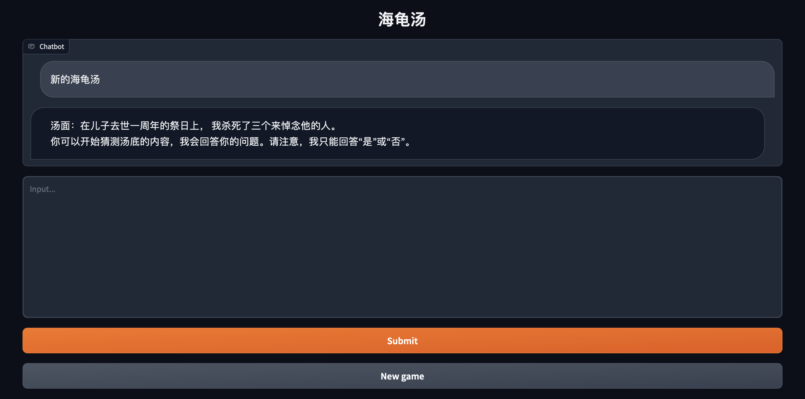

# Text-Based Games by Large Language Model

## Introduction

We aim to realize text-based game by Large Language Model. Recently we have Lateral Thinking Puzzle, and more games are upcoming.

## Game Demo

We provide a Web demo based on [Gradio](https://gradio.app) and a command line demo in the repo. First clone our repo with:

```shell
git clone https://github.com/mkw18/LLMTextGame
cd LLMTextGame
pip install -r requirements.txt
```

We use gpt-3.5 in the demo. Before using the demo, paste your openai api key at `openai.api_key = "your-openai-api-key"`. 

### Web Demo



Install Gradio `pip install gradio`，and run [web_demo_en.py](web_demo_en.py) or Chinese demo [web_demo_zh.py](web_demo_zh.py):

```shell
python web_demo_en.py
python web_demo_zh.py
```

The program runs a web server and outputs the URL. Open the URL in the browser to use the web demo.

### CLI Demo


Run [cli_demo_en.py](cli_demo_en.py) or Chinese demo [cli_demo_zh.py](cli_demo_zh.py) in the repo:

```shell
python cli_demo_en.py
python cli_demo_zh.py
```

The command runs an interactive program in the shell. Type your instruction in the shell and hit enter to generate the response. Type `finish` to start a new game and clear the dialogue history and `stop` to terminate the program.

## License

This repository is licensed under the [Apache-2.0 License](LICENSE). The use of ChatGLM-6B model weights is subject to the [Model License](MODEL_LICENSE)。
